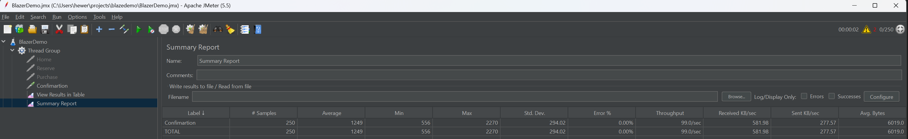

# Cenário:  

* Compra de passagem aérea - Passagem comprada com sucesso. 
 
# Critério de Aceitação: 

* 250 requisições por segundo com um tempo de resposta 90th percentil inferior a 2 segundos. 

- Quantidade de Amostras: Foram executadas um total de 250 amostras apenas para o cenário de "Confirmação".

- Tempo de Resposta Médio (Average): O tempo de resposta médio para as amostras de "Confirmação" foi de 1249 milissegundos.

- Tempo de Resposta Mínimo (Min) e Máximo (Max): O tempo de resposta mínimo registrado foi de 556 milissegundos, enquanto o tempo de resposta máximo foi de 2270 milissegundos.

- Desvio Padrão (Std. Dev.): O desvio padrão dos tempos de resposta foi de 294,02, indicando uma variabilidade considerável.

- Percentual de Erro (Error %): O percentual de erro registrado foi de 0%, o que significa que não houve erros durante o teste.

- Taxa de Transferência (Throughput): A taxa de transferência registrada foi de 99,00990 solicitações por segundo, indicando a capacidade do sistema em lidar com a carga de requisições.

- Taxa de Transferência Recebida (Received KB/sec) e Enviada (Sent KB/sec): A taxa de transferência recebida foi de 581,98 KB por segundo, enquanto a taxa de transferência enviada foi de 277,57 KB por segundo.

- Tamanho Médio das Requisições (Avg. Bytes): O tamanho médio das requisições foi de 6019,0 bytes.

- O critério de aceitação estabelece que deve haver 250 requisições por segundo e um tempo de resposta 90th percentil inferior a 2 segundos. No entanto, nos resultados apresentados, temos apenas uma amostra para o cenário de "Confirmação" com 250 solicitações.

- Além disso, o tempo de resposta médio para esse cenário é de 1249 milissegundos, o que excede em muito o limite estabelecido de 2 segundos. O tempo de resposta mínimo é de 556 milissegundos e o máximo é de 2270 milissegundos.

- Portanto, com base nessas informações, podemos concluir que o critério de aceitação não foi atendido. É necessário realizar ajustes e otimizações no sistema para melhorar o tempo de resposta e aumentar a capacidade de lidar com a carga de 250 requisições por segundo.

- Recomenda-se investigar os possíveis gargalos e identificar oportunidades de melhoria no desempenho do sistema para que ele atenda aos requisitos estabelecidos no critério de aceitação.

Evidência:

